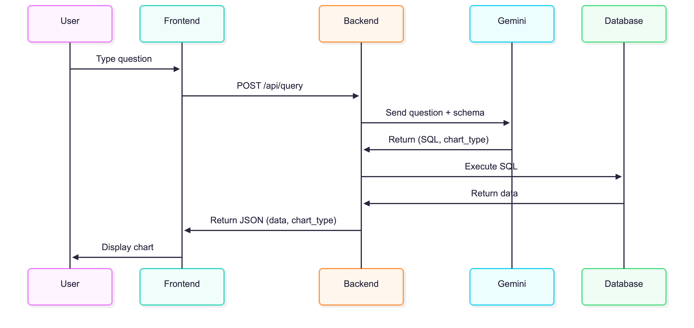

# DataToVisual

A data-to-visualization system where users can ask business questions in plain English and instantly see the answer as a chart.

## Architecture




## Tech Stack

- **Backend**: Python + FastAPI
- **Database**: PostgreSQL
- **LLM**: Google Gemini API
- **Frontend**: HTML/CSS/JS + Chart.js
- **Containerization**: Docker

## Setup

### Prerequisites

- Docker & Docker Compose
- Gemini API key ([Get one free](https://aistudio.google.com/))

### 1. Clone and configure

```bash
git clone <repo-url>
cd DataToVisual

# Create .env file
cp .env.example .env
# Edit .env and add your GEMINI_API_KEY
```

### 2. Start the services

```bash
docker-compose up -d
```

### 3. Seed the database

```bash
docker exec datatovisual_backend python -m app.db.seed
```

### 4. Open the frontend

Open `frontend/index.html` in your browser, or serve it:

```bash
cd frontend
python -m http.server 3000
# Then open http://localhost:3000
```

## Example Queries

| Question | Chart Type |
|----------|------------|
| "Compare total sales in 2026 vs 2022" | Bar |
| "How are our sales trending over the last 5 years?" | Line |
| "What are our top 5 selling products?" | Bar |
| "Show sales by product category" | Pie |
| "Monthly sales for 2025" | Line |

## API Endpoints

Base URL: `http://localhost:8000/api/v1`

### POST /api/v1/query

```json
// Request
{ "question": "Compare total sales in 2026 vs 2022" }

// Response
{
  "success": true,
  "question": "Compare total sales in 2026 vs 2022",
  "sql": "SELECT EXTRACT(YEAR FROM sale_date) as year, SUM(total_amount) as total FROM sales WHERE EXTRACT(YEAR FROM sale_date) IN (2022, 2026) GROUP BY year",
  "chart_type": "bar",
  "data": {
    "labels": ["2022", "2026"],
    "datasets": [{ "label": "Total", "data": [125000, 189000] }]
  }
}
```

### GET /api/v1/health

Returns `{"status": "ok"}` if the server is running.

## Project Structure

```
DataToVisual/
├── docker-compose.yml
├── .env.example
├── backend/
│   ├── app/
│   │   ├── main.py           # FastAPI entry point
│   │   ├── config.py         # Environment config
│   │   ├── routers/
│   │   │   └── query.py      # API endpoints
│   │   ├── schemas/
│   │   │   └── query.py      # Pydantic models
│   │   ├── services/
│   │   │   └── llm_service.py # Gemini API integration
│   │   └── db/
│   │       ├── database.py   # PostgreSQL connection
│   │       └── seed.py       # Sample data
│   ├── Dockerfile
│   └── requirements.txt
├── frontend/
│   ├── index.html
│   ├── style.css
│   └── app.js
└── docs/
    ├── architecture.png
    └── sequence_diagram.png
```

## Database Schema

- **products**: id, name, category, price, created_at
- **features**: id, product_id, name, description
- **sales**: id, product_id, quantity, total_amount, sale_date

Sales data spans 2022-2026 with realistic growth trends.
